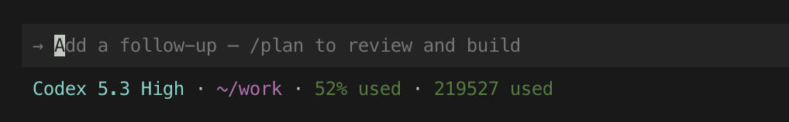

# cursor-statusline

`cursor-statusline` is an interactive setup tool for Cursor CLI status lines.
It generates a runtime `~/.cursor/statusline.sh` script and wires it into your Cursor config.

Japanese README: [README.ja.md](README.ja.md)



## Design

- Runtime `statusLine.command` points to `~/.cursor/statusline.sh`
- `npx -y cursor-statusline` is only used for setup/update
- After setup, Cursor can run with the generated script only

## Setup

```bash
npx -y cursor-statusline
```

Running setup performs the following:

1. Choose enabled items, order, and color options in interactive UI
2. Save `~/.config/cursor-statusline/config.toml`
3. Generate or update `~/.cursor/statusline.sh`
4. Set `statusLine.command` to `~/.cursor/statusline.sh` in `~/.cursor/cli-config.json`

`-y` is shorthand for `--yes`, which auto-confirms `npx` package prompts.

## Controls in Setup UI

- Type to filter items
- Press `Space` to toggle an item ON/OFF
- Press `Enter` to confirm selection
- Reorder step starts right after selection:
  - Choose whether to reorder
  - Pick the item to move
  - Pick destination index
  - Repeat until order is finalized

## Default Items (v1)

- `model`
- `current-dir`
- `git-branch`
- `context-used`

## Supported Items (v1)

- model
- model-with-params
- current-dir
- project-name
- git-branch
- git-diff
- context-used
- context-remaining
- context-window-size
- tokens-used
- tokens-in
- tokens-out
- session-id
- session-name
- cli-version
- vim-mode
- worktree-name

## Development

```bash
npm install
npm run check
npm test
npm run build
```

